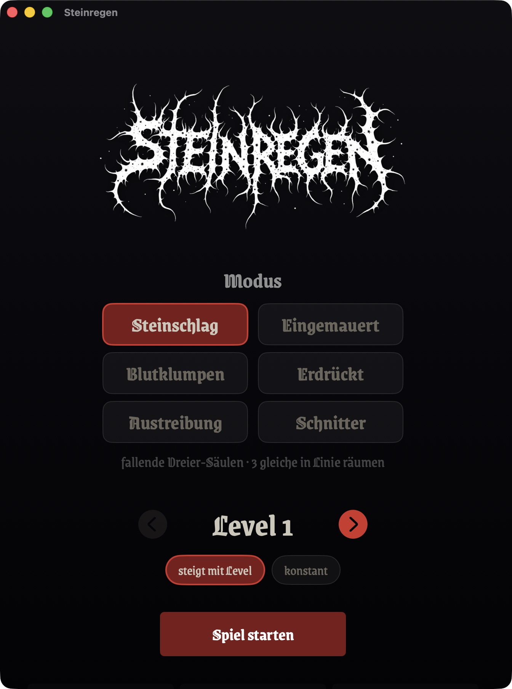
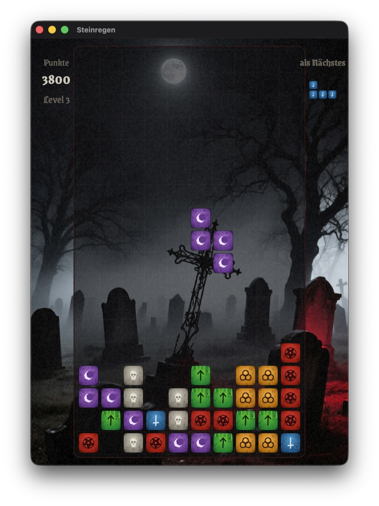
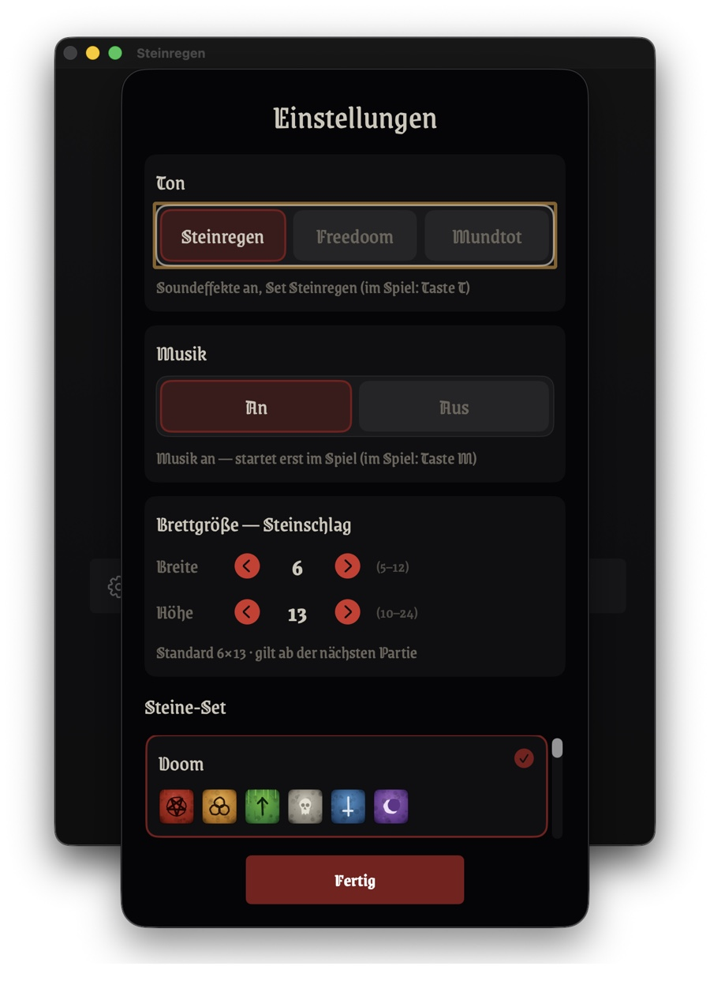

# Steinregen

Ein natives macOS- und iOS-Spiel in roher Black-Metal-Ästhetik — zwei Fallstein-Modi auf einer
gemeinsamen Engine. Geschrieben in Swift mit SwiftUI und SpriteKit.

*(English version: [README.md](README.md))*

<p align="center">
  
  
  
</p>

## Modi

- **Steinschlag** (Columns-Art) — es fallen Dreier-Säulen aus Steinen. **Drei oder mehr gleiche**
  in einer Linie — waagerecht, senkrecht oder diagonal — werden geräumt; geräumte Steine lassen
  die darüber liegenden nachrutschen, was Kettenreaktionen mit Bonuspunkten auslösen kann.
- **Eingemauert** (Tetris-Art) — es fallen Tetrominos (Vier-Block-Formen). Eine ganze Reihe füllen
  räumt sie. Sieben Formen, ein 7-Beutel-Zufallsgeber, einfache Wall-Kicks.

Beide Modi laufen auf demselben Kern und teilen sich Optik, Ton, Musik und
Bestenliste. Modus (und Brettgröße) wählt man im Startbildschirm.

## Optik

Pechschwarz, knochenweiß, ein einziger Ochsenblut-Akzent, Korn-Textur, ein zackiges, von Hand
getuschtes Logo und KI-generierte Nebel-bei-Nacht-Hintergründe. Die sechs Steine unterscheiden
sich über ein weißes **Sigil** (Form), dazu eine gedeckte, entsättigte Farb-Tönung.

## Funktionen

- **6 Steine mit Sigillen** — umgekehrtes Pentagramm, inverses Kreuz, Tiwaz-Rune, Triquetra,
  Schädel, Mondsichel. Unterscheidung über die Form, dazu eine gedeckte Farb-Tönung als Zusatzhinweis.
- **Wählbare Steine-Sets** — in den Einstellungen (mit Live-Vorschau) zwischen sechs Sets
  umschalten: den Black-Metal-Sets „Sigille" und „Doom", drei freundlicheren Edelstein-Sets aus
  dem Schwester-Projekt *Zaubersteine* („Zaubersteine", „G20", „Juwelen") sowie einem
  „FreeDoom"-Pixel-Set aus originalen Freedoom-Sprites. Ein weiteres Set = ein Renderer plus ein
  Registry-Eintrag.
- **Einstellbare Brettgröße** je Modus, in den Einstellungen.
- **Wählbares Start-Tempo** (Stufen 1–10), das mit den geräumten Steinen steigt — oder ein
  konstantes „Endlos"-Tempo, das auf der Start-Stufe bleibt.
- **Friedhof (Bestenliste)** — beim Verrecken trägt man einen Namen ein (bis 16 Zeichen); jedes
  Grab zeigt Punkte und das Level, in dem man verreckt ist. Persistente Top 16, im Menü abrufbar.
- **Soundeffekte** (lokal erzeugt) — Aufsetzen, Auflösen, Drehen, Level und Game-Over, mit
  mehreren zufälligen Varianten pro Ereignis. In den Einstellungen wählt man ein Klang-Set —
  Steinregen (die eigenen Klänge), Freedoom oder Mundtot (stumm); im Spiel schaltet **T** um.
- **Musik** (lokal erzeugt) — drei instrumentale Atmospheric-Black-Metal-Stücke, die nacheinander
  in Schleife laufen, pro Partie mit zufälligem Anfangsstück. Standardmäßig an, aber erst ab
  Levelbeginn (nicht im Menü); getrennt von den Soundeffekten ausschaltbar — in den Einstellungen
  oder im Spiel mit **M**.
- **Hintergründe** — KI-generierte Nebel-bei-Nacht-Motive (Friedhof, toter Winterwald,
  Kathedralenruine, Nebelmoor, blutroter Mond); pro Partie ein anderes, nie dasselbe zweimal
  hintereinander.
- **Magic Jewel** — eine seltene, helle Säule, die durch alle sechs Sigille pulsiert. Wo sie
  aufsetzt, räumt sie brettweit die Sorte der Zelle direkt darunter weg.
- **Reproduzierbar, seed-getrieben** — gleicher Seed spielt exakt dieselbe Partie nach, Zug für Zug.
- **Läuft auf macOS** (Tastatur) **und iOS / iPad** (Touch), mit demselben Kern und Renderer.
- **Deutsch und Englisch** — die Oberfläche folgt der System-Sprache und ist in den Einstellungen umschaltbar.

## Steuerung

Auf iOS wird per Touch gespielt (Tippen = drehen, Wischen = bewegen/fallen, dazu Knöpfe am
unteren Rand). Auf macOS per Tastatur:

| Taste | Aktion |
|-------|--------|
| ← → · A D | Stein bewegen |
| ↑ · W | drehen |
| ↓ · S | schneller fallen (Softdrop) |
| Leertaste | sofort fallen lassen |
| T | Soundeffekte an/aus (aus = „mundtot") |
| M | Musik an/aus |
| Esc | zurück ins Hauptmenü |

## Bauen & Starten

Voraussetzung: macOS 15+ und die Xcode-Toolchain.

```bash
swift build
swift run Steinregen
```

### Doppelklickbare App (mit Dock-Icon)

```bash
bash tools/make-app.sh
```

Baut `dist/Steinregen.app` (ad-hoc-signiert, mit einem prozedural erzeugten Dock-Icon —
umgekehrtes Pentagramm) plus ein weitergebbares `dist/Steinregen-<version>.zip`. Die `.app` im
Finder doppelklicken oder nach `/Programme` ziehen. Für einen notarisierten, Gatekeeper-tauglichen
Build: `bash tools/make-notarized.sh` (braucht ein Developer-ID-Zertifikat und ein
notarytool-Schlüsselbund-Profil).

### Notarisiertes DMG (zur Weitergabe)

```bash
bash tools/make-dmg.sh                 # signiert + notarisiert (braucht Developer-ID-Zertifikat + Notar-Profil)
bash tools/make-dmg.sh --no-notarize   # unsigniert — schneller lokaler Layout-Test
```

Baut `dist/Steinregen-<version>.dmg`: die signierte App in einem DMG mit Installations-Hintergrund
und `Applications`-Shortcut, notarisiert und gestapelt, sodass es ohne Gatekeeper-Warnung öffnet.
Der Hintergrund stammt aus `tools/generate-dmg-background.swift` (→ `assets/dmg-background.png`).

`bash tools/make-dmg.sh --publish` setzt zusätzlich den Tag `v<version>` und legt das passende
GitHub-Release mit dem DMG an (Notes aus `CHANGELOG.md`). Ein Release entsteht pro Versions-Bump —
reine Doku- oder andere Änderungen ohne `VERSION`-Bump erzeugen kein neues DMG.

### iOS-App

```bash
bash tools/make-ios-app.sh run
```

Erzeugt per xcodegen aus `project.yml` ein Xcode-Projekt und baut + startet die App im
iOS-Simulator (braucht volles Xcode und `xcodegen`).

### Tests

`swift test` allein scheitert auf Systemen mit nur den Command Line Tools (kein XCTest).
Stattdessen die Xcode-Toolchain nutzen:

```bash
DEVELOPER_DIR=/Applications/Xcode.app/Contents/Developer xcrun swift test
```

### Headless / Automation

Die App wertet Umgebungsvariablen aus, damit sie ohne Menü gesteuert werden kann (für
automatische Screenshots und Smoke-Tests):

```bash
STEINREGEN_AUTOSTART=1 STEINREGEN_LEVEL=8 STEINREGEN_SEED=4242 swift run Steinregen
```

- `STEINREGEN_AUTOSTART=1` — startet sofort ein Spiel
- `STEINREGEN_LEVEL=<1..10>` — Start-Tempo
- `STEINREGEN_SEED=<UInt64>` — fester Seed (sonst zufällig)
- `STEINREGEN_SET=<id>` — Steine-Set (`sigil` / `doom` / `zaubersteine` / `g20` / `juwelen` / `freedoom`)
- `STEINREGEN_MODE=<saeulen|verschuettet>` — Modus (Steinschlag / Eingemauert)
- `STEINREGEN_ENDLESS=1` — konstantes Tempo
- `STEINREGEN_MUSIC=<0|1>` — Musik aus / an erzwingen
- `STEINREGEN_SETTINGS=1` — öffnet beim Start den Einstellungsdialog
- `STEINREGEN_FRIEDHOF=1` — öffnet beim Start den Friedhof (Bestenliste)

## Architektur

Drei Swift-Package-Manager-Module plus Tests:

- **`SteinregenCore`** — reine Spiellogik. Zwei Engines (`Engine` für
  Steinschlag, `TetrominoEngine` für Eingemauert), Brett, Treffer-Erkennung, Kaskaden, Magic
  Jewel, Punkte. Kein globaler Zufall, keine Wanduhr; aller Zufall läuft über einen injizierten,
  seed-bestimmten PRNG, sodass ein gegebener Seed immer identisch nachspielt.
- **`SteinregenRender`** — SpriteKit-Szene, die beide Modi über ein `PlayEngine`-Protokoll treibt:
  Darstellung, Schwerkraft-/Animations-Loop, die prozedural gezeichneten Steine-Sets, das Theme
  (Palette/Fonts/Korn), Soundeffekte, der Musik-Player und die Magic-Jewel-Animation.
- **`SteinregenApp`** — SwiftUI-Shell für macOS und iOS: Menüs, Einstellungen, Spielregeln,
  Friedhof, Game-Over-Overlay. Tastatur auf macOS, Touch auf iOS.

Mehrere wiederverwendete Bausteine (der seed-bestimmte PRNG, der robuste Ressourcen-Loader,
das Drei-Modul-Layout) sowie die drei freundlichen Edelstein-Sets (Zaubersteine / G20 / Juwelen)
stammen aus dem Schwester-Projekt *Zaubersteine*.

## Markenrechte

Steinregen ist ein eigenständiges Projekt, steht in keiner Verbindung zu Dritten und wird von
ihnen weder unterstützt noch gefördert. Seine zwei Modi sind von klassischen Fallstein-Spielen
inspiriert und werden nur beschreibend zum Vergleich genannt: *Columns* ist eine Marke von Sega,
*Tetris* eine eingetragene Marke der The Tetris Company, LLC. Steinregens eigene Modi heißen
*Steinschlag* und *Eingemauert*; es verwendet weder *Columns* noch *Tetris* als eigenen Namen und
liefert keine Grafiken, Klänge oder den Trade-Dress dieser Spiele mit. Spielmechaniken sind nicht
urheberrechtlich schützbar, die Namen schon — sie erscheinen hier rein als beschreibende
(nominative) Nennung.

## Lizenz

MIT — siehe [LICENSE](LICENSE).

Titel-/HUD-Schrift: **Grenze Gotisch** von Omnibus-Type, lizenziert unter der
[SIL Open Font License](Sources/SteinregenRender/Resources/GrenzeGotisch-OFL.txt).

Die „FreeDoom"-Steine-Sprites stammen aus dem
[Freedoom](https://github.com/freedoom/freedoom)-Projekt (dessen eigene freie Assets, nicht das
kommerzielle Original-Doom-Material), lizenziert unter
[BSD-3-Clause](Sources/SteinregenRender/Resources/FREEDOOM-LICENSE.txt).

Die Soundeffekte wurden lokal mit einem offenen Audio-Modell (Stable Audio 3) erzeugt, die drei
Musikstücke mit dem offenen **ACE-Step**-Modell, die Nebel-bei-Nacht-Hintergründe mit dem offenen
**Qwen-Image**-Modell. Alle sind Teil dieses Projekts. Vollständige Attribution und Lizenzlage:
[THIRD-PARTY-ASSETS.md](THIRD-PARTY-ASSETS.md).

🤖 Gebaut mit [Claude Code](https://claude.com/claude-code).
