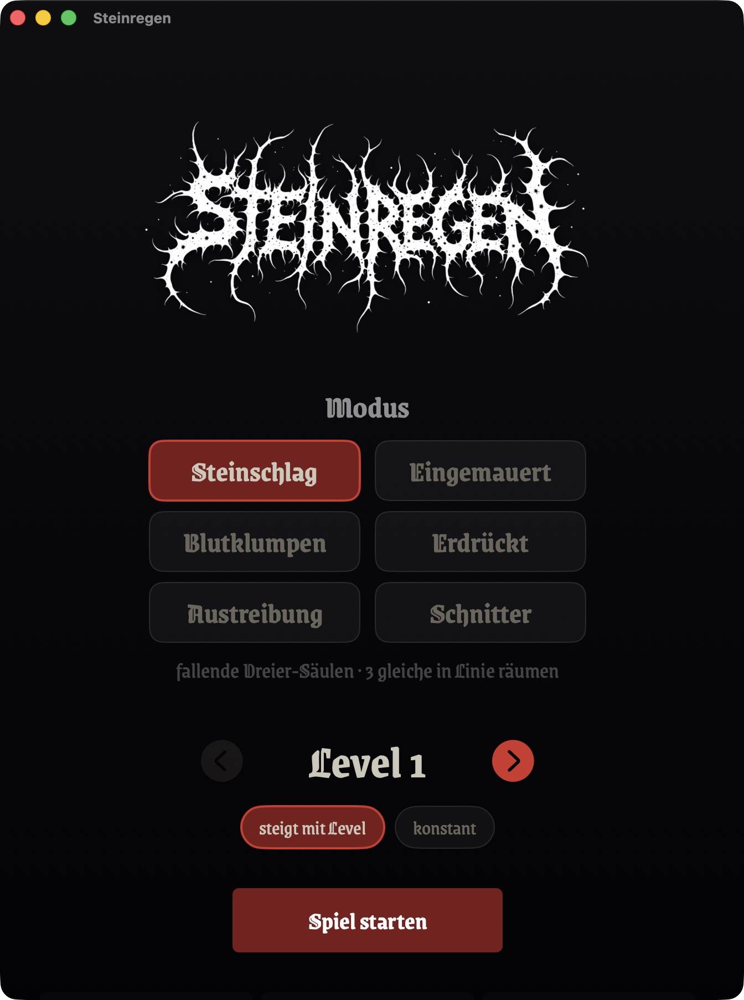
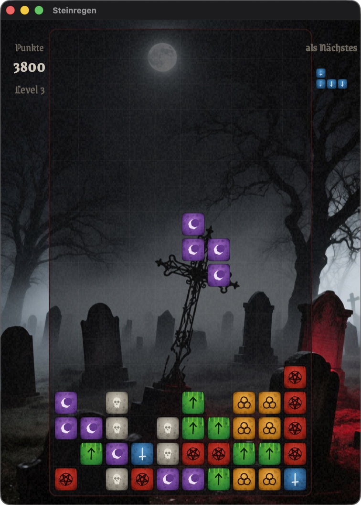
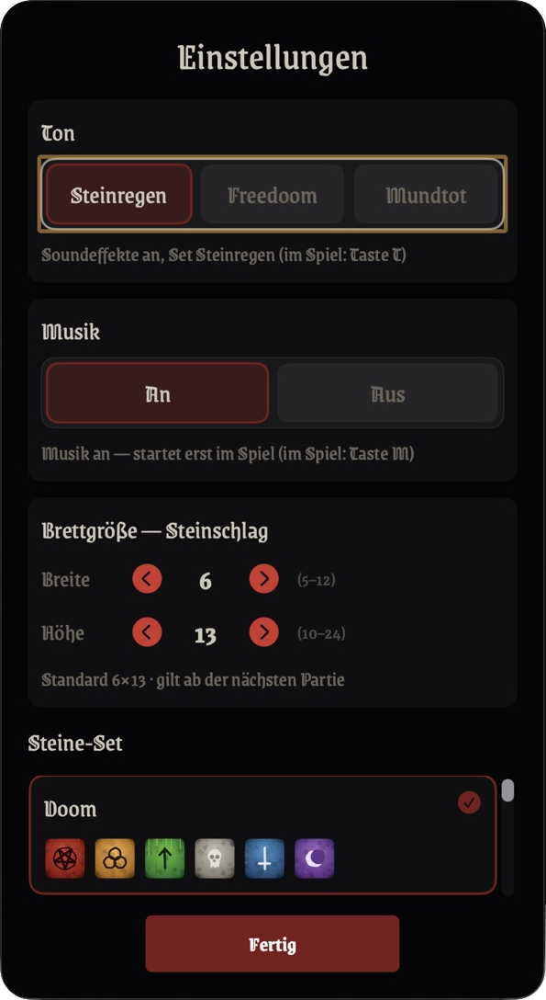

# Steinregen

Ein natives Spiel für Apple-Silicon-Macs und iOS in roher Black-Metal-Ästhetik — sechs
Fallstein-Spielmodi auf einem gemeinsamen, deterministischen Kern. Geschrieben in Swift mit
SwiftUI und SpriteKit.

**🌐 Sprache / Language:** [English](README.md) · [Deutsch](README.de.md)

<p align="center">
  
  
  
</p>

## Download / Releases

Fertige, von Apple notarisierte macOS-Builds gibt es als DMG auf der
[Releases-Seite](../../releases): DMG laden, öffnen und
Steinregen in den Programme-Ordner ziehen. Voraussetzung ist macOS 15+ auf Apple Silicon. Für den
Bau der macOS- oder iOS-App aus dem Quellcode siehe [Bauen & Starten](#bauen--starten) unten.

## Modi

- **Steinschlag** (Columns-Art) — es fallen Dreier-Säulen aus Steinen. **Drei oder mehr gleiche**
  in einer Linie — waagerecht, senkrecht oder diagonal — werden geräumt; geräumte Steine lassen
  die darüber liegenden nachrutschen, was Kettenreaktionen mit Bonuspunkten auslösen kann.
- **Eingemauert** (Tetris-Art) — es fallen Tetrominos (Vier-Block-Formen). Eine ganze Reihe füllen
  räumt sie. Sieben Formen, ein 7-Beutel-Zufallsgeber, einfache Wall-Kicks.
- **Blutklumpen** (Puyo-Art) — es fallen Zweier-Paare in vier Farben. Vier oder mehr gleiche,
  seitlich verbundene Steine werden geräumt; die Hälften fallen unabhängig, Kaskaden ketten sich.
- **Erdrückt** (Pentomino-Variante) — der brutale Bruder von Eingemauert: alle 18 einseitigen
  Fünflinge (Fünf-Block-Formen) auf einem größeren Brett.
- **Austreibung** (Dr.-Mario-Art) — das Brett beginnt mit festsitzenden Flüchen übersät. Drei
  Farben; vier oder mehr in Reihe oder Spalte werden geräumt. Alle Flüche getilgt = **gewonnen** —
  der einzige Modus mit Sieg-Bedingung.
- **Schnitter** (Lumines-Art) — es fallen 2×2-Blöcke aus zwei Steinsorten. Gleichfarbige
  2×2-Quadrate werden markiert und von einer Sense geerntet, die über das Brett streicht.

Alle sechs Modi laufen auf demselben deterministischen Kern und teilen sich Optik, Ton, Musik und
Bestenliste. Modus (und Brettgröße je Modus) wählt man im Startbildschirm.

## Optik

Pechschwarz, knochenweiß, ein einziger Ochsenblut-Akzent, Korn-Textur, ein zackiges, von Hand
getuschtes Logo und KI-generierte Nebel-bei-Nacht-Hintergründe. Die sechs Steine unterscheiden
sich über ein weißes **Sigil** (Form), dazu eine gedeckte, entsättigte Farb-Tönung.

## Funktionen

- **6 Steine mit Sigillen** — umgekehrtes Pentagramm, inverses Kreuz, Tiwaz-Rune, Triquetra,
  Schädel, Mondsichel. Unterscheidung über die Form, dazu eine gedeckte Farb-Tönung als Zusatzhinweis.
- **Wählbare Steine-Sets** — in den Einstellungen (mit Live-Vorschau) zwischen sechs Sets
  umschalten: den Black-Metal-Sets „Sigille" und „Doom", drei freundlicheren Edelstein-Sets aus
  dem Schwester-Projekt *Zaubersteine* („Zaubersteine", „G20", „Juwelen") sowie einem
  „FreeDoom"-Pixel-Set aus originalen Freedoom-Sprites. Ein weiteres Set = ein Renderer plus ein
  Registry-Eintrag.
- **Einstellbare Brettgröße** je Modus, in den Einstellungen.
- **Wählbares Start-Tempo** (Stufen 1–10), das mit den geräumten Steinen steigt — oder ein
  konstantes „Endlos"-Tempo, das auf der Start-Stufe bleibt.
- **Friedhof (Bestenliste)** — beim Verrecken trägt man einen Namen ein (bis 16 Zeichen). Die
  persistente Top 16 zeigt Namen und Punktzahlen und ist im Menü abrufbar.
- **Soundeffekte** — Aufsetzen, Auflösen, Drehen, Level und Game-Over, mit mehreren zufälligen
  Varianten pro Ereignis. In den Einstellungen wählt man Steinregen (lokal erzeugt), Freedoom
  (BSD-3-Clause) oder Mundtot (stumm); im Spiel schaltet **T** um.
- **Musik** (KI-erzeugt) — 13 atmosphärische instrumentale Metal-Stücke in zufälliger,
  nicht wiederholender Reihenfolge: Jedes Stück läuft einmal, bevor neu gemischt wird. Drei
  entstanden lokal mit ACE-Step XL Turbo, zehn mit MiniMax Music 2.6; alle liegen als Stereo-MP3
  mit 128 kbit/s vor. Standardmäßig an, aber erst ab Levelbeginn (nicht im Menü); getrennt von den
  Soundeffekten ausschaltbar — in den Einstellungen oder im Spiel mit **M**.
- **Hintergründe** — KI-generierte Nebel-bei-Nacht-Motive (Friedhof, toter Winterwald,
  Kathedralenruine, Nebelmoor, blutroter Mond); pro Partie ein anderes, nie dasselbe zweimal
  hintereinander.
- **Magic Jewel** (Steinschlag) — eine seltene, helle Säule, die durch alle sechs Sigille
  pulsiert. Wo sie aufsetzt, räumt sie brettweit die Sorte der Zelle direkt darunter weg.
- **Reproduzierbar, seed-getrieben** — gleicher Seed spielt exakt dieselbe Partie nach, Zug für Zug.
- **Läuft auf Apple-Silicon-Macs** (Tastatur) **und iOS / iPad** (Touch), mit demselben Kern und
  Renderer. Intel-Macs sind kein unterstütztes Release-Ziel.
- **Deutsch und Englisch** — die Oberfläche folgt der System-Sprache und ist in den Einstellungen umschaltbar.

## Datenschutz

Steinregen läuft vollständig offline. Es gibt keine Konten, Analyse, Telemetrie, Werbung oder
Netzwerkzugriffe. Einstellungen und Friedhof liegen ausschließlich lokal im `UserDefaults`-
Container der App und werden nie übertragen.

## Steuerung

Auf iOS wird per Touch gespielt (Tippen = drehen, Wischen = bewegen/fallen, dazu Knöpfe am
unteren Rand). Auf macOS per Tastatur:

| Taste | Aktion |
|-------|--------|
| ← → · A D | Stein bewegen |
| ↑ · W | drehen |
| ↓ · S | schneller fallen (Softdrop) |
| Leertaste | sofort fallen lassen |
| T | Soundeffekte an/aus (aus = „mundtot") |
| M | Musik an/aus |
| Esc | zurück ins Hauptmenü |

## Bauen & Starten

Voraussetzung: Apple-Silicon-Mac mit macOS 15+ und die Xcode-Toolchain.

```bash
swift build
swift run Steinregen
```

### Doppelklickbare App (mit Dock-Icon)

```bash
bash tools/make-app.sh
```

Baut eine arm64-`dist/Steinregen.app` (ad-hoc-signiert, mit einem prozedural erzeugten Dock-Icon —
umgekehrtes Pentagramm) plus ein weitergebbares `dist/Steinregen-<version>.zip`. Die `.app` im
Finder doppelklicken oder nach `/Programme` ziehen. Für einen notarisierten, Gatekeeper-tauglichen
Build mit Developer-ID-Zertifikat und notarytool-Schlüsselbund-Profil:

```bash
NOTARY_PROFILE=profil-name bash tools/make-notarized.sh
```

### Notarisiertes DMG (zur Weitergabe)

```bash
NOTARY_PROFILE=profil-name bash tools/make-dmg.sh
bash tools/make-dmg.sh --no-notarize   # unsigniert — schneller lokaler Layout-Test
```

Baut `dist/Steinregen-<version>.dmg`: die signierte App in einem DMG mit Installations-Hintergrund
und `Applications`-Shortcut, notarisiert und gestapelt, sodass es ohne Gatekeeper-Warnung öffnet.
Der Hintergrund stammt aus `tools/generate-dmg-background.swift` (→ `assets/dmg-background.png`).

Die zusätzliche Variable `GITHUB_REPO=owner/name` und das Argument `--publish` am signierten Befehl
setzen den Tag `v<version>` und legen das passende GitHub-Release mit dem DMG an (Notes aus
`CHANGELOG.md`). Dafür
braucht es ein angemeldetes `gh`, einen sauberen lokalen `main` und denselben Stand auf dem Remote
`github` (oder `GITHUB_REMOTE=remote-name`). Gepusht wird nur dieser Release-Tag; lokale Archiv-Tags
bleiben privat. Ein Release entsteht pro Versions-Bump — reine Doku- oder andere Änderungen ohne
`VERSION`-Bump erzeugen kein neues DMG.

### iOS-App

```bash
bash tools/make-ios-app.sh run
```

Erzeugt per xcodegen aus `project.yml` ein Xcode-Projekt und baut + startet die App im
iOS-Simulator (braucht volles Xcode und `xcodegen`).

### Tests

`swift test` allein scheitert auf Systemen mit nur den Command Line Tools (kein XCTest).
Stattdessen die Xcode-Toolchain nutzen:

```bash
DEVELOPER_DIR=/Applications/Xcode.app/Contents/Developer xcrun swift test
```

Der nicht veröffentlichende Release-Vorabcheck prüft Versionskonsistenz, Pflichtdokumente und
Lizenzen, lokale Markdown-Links, Medien-Pools, Social Preview, Shell-Syntax, private Strings und —
falls installiert — die Git-Historie mit gitleaks:

```bash
bash tools/check-release-readiness.sh
```

### Headless / Automation

Die App wertet Umgebungsvariablen aus, damit sie ohne Menü gesteuert werden kann (für
automatische Screenshots und Smoke-Tests):

```bash
STEINREGEN_AUTOSTART=1 STEINREGEN_LEVEL=8 STEINREGEN_SEED=4242 swift run Steinregen
```

- `STEINREGEN_AUTOSTART=1` — startet sofort ein Spiel
- `STEINREGEN_LEVEL=<1..10>` — Start-Tempo
- `STEINREGEN_SEED=<UInt64>` — fester Seed (sonst zufällig)
- `STEINREGEN_SET=<id>` — Steine-Set (`sigil` / `doom` / `zaubersteine` / `g20` / `juwelen` / `freedoom`)
- `STEINREGEN_MODE=<id>` — Modus: `saeulen` (Steinschlag), `verschuettet` (Eingemauert),
  `klumpen` (Blutklumpen), `fuenfling` (Erdrückt), `kapseln` (Austreibung), `schnitter` (Schnitter)
- `STEINREGEN_ENDLESS=1` — konstantes Tempo
- `STEINREGEN_MUSIC=<0|1>` — Musik aus / an erzwingen
- `STEINREGEN_LANG=<de|en>` — erzwingt die Sprache (sonst System-Sprache bzw. gespeicherte Wahl)
- `STEINREGEN_SETTINGS=1` — öffnet beim Start den Einstellungsdialog
- `STEINREGEN_FRIEDHOF=1` — öffnet beim Start den Friedhof (Bestenliste)
- `STEINREGEN_RULES=1` — öffnet beim Start die Spielregeln

## Architektur

Drei Swift-Package-Manager-Module plus Tests:

- **`SteinregenCore`** — reine Spiellogik. Fünf Engines (`Engine` für Steinschlag,
  `TetrominoEngine` für Eingemauert und Erdrückt, `PairEngine` für Blutklumpen, `CapsuleEngine`
  für Austreibung, `SquareEngine` für Schnitter), Brett, Treffer-Erkennung, Kaskaden, Magic
  Jewel, Punkte. Kein globaler Zufall, keine Wanduhr; aller Zufall läuft über einen injizierten,
  seed-bestimmten PRNG, sodass ein gegebener Seed immer identisch nachspielt.
- **`SteinregenRender`** — SpriteKit-Szene, die alle Modi über ein `PlayEngine`-Protokoll treibt:
  Darstellung, Schwerkraft-/Animations-Loop, die prozedural gezeichneten Steine-Sets, das Theme
  (Palette/Fonts/Korn), Soundeffekte, der Musik-Player und die Magic-Jewel-Animation.
- **`SteinregenApp`** — SwiftUI-Shell für macOS und iOS: Menüs, Einstellungen, Spielregeln,
  Friedhof, Game-Over-Overlay. Tastatur auf macOS, Touch auf iOS.

Mehrere wiederverwendete Bausteine (der seed-bestimmte PRNG, der robuste Ressourcen-Loader,
das Drei-Modul-Layout) sowie die drei freundlichen Edelstein-Sets (Zaubersteine / G20 / Juwelen)
stammen aus dem Schwester-Projekt *Zaubersteine*.

## Markenrechte

Steinregen ist ein eigenständiges Projekt und steht in keiner Verbindung zu den genannten
Rechteinhabern; es wird von ihnen weder unterstützt noch gefördert. *Columns* und *Puyo Puyo* sind
Marken von Sega, *Tetris* ist eine eingetragene Marke der The Tetris Company, LLC, *Dr. Mario*
eine Marke von Nintendo und *Lumines* eine Marke ihres jeweiligen Inhabers. Diese Namen erscheinen
nur als beschreibende Vergleiche. Steinregen verwendet eigene Modusnamen sowie eine eigenständige
Präsentation mit eigenen Grafiken und Klängen.

## Lizenz

Der Quellcode ist unter MIT lizenziert — siehe [LICENSE](LICENSE). Für gebündelte fremde und
generierte Assets gelten eigene Bedingungen und Attributionen; die vollständige Übersicht steht
in [THIRD-PARTY-ASSETS.md](THIRD-PARTY-ASSETS.md). Die FLUX.1-[dev]-Lizenz beschränkt die Nutzung
des Modells, erlaubt die Nutzung erzeugter Outputs jedoch ausdrücklich für jeden Zweck,
einschließlich kommerzieller Nutzung. Die App-Bundles enthalten den MIT-Hinweis, diese
Asset-Übersicht sowie die erforderlichen Freedoom- und Schrift-Lizenztexte.

Titel-/HUD-Schrift: **Grenze Gotisch** von Omnibus-Type, lizenziert unter der
[SIL Open Font License](Sources/SteinregenRender/Resources/GrenzeGotisch-OFL.txt).

Die „FreeDoom"-Steine-Sprites stammen aus dem
[Freedoom](https://github.com/freedoom/freedoom)-Projekt (dessen eigene freie Assets, nicht das
kommerzielle Original-Doom-Material), lizenziert unter
[BSD-3-Clause](Sources/SteinregenRender/Resources/FREEDOOM-LICENSE.txt).

Das Steinregen-Klangset wurde lokal mit Stable Audio 3 erzeugt; das alternative Freedoom-Set steht
unter BSD-3-Clause. Drei Musikstücke entstanden mit **ACE-Step XL Turbo**, zehn mit MiniMax Music
2.6, die Nebel-bei-Nacht-Hintergründe mit **Qwen-Image**. Alle sind Teil dieses Projekts.
Vollständige Attribution
und Lizenzlage:
[THIRD-PARTY-ASSETS.md](THIRD-PARTY-ASSETS.md).

Sicherheitslücken bitte gemäß [SECURITY.md](SECURITY.md) melden; sensible Details gehören nie in
ein öffentliches Issue.
