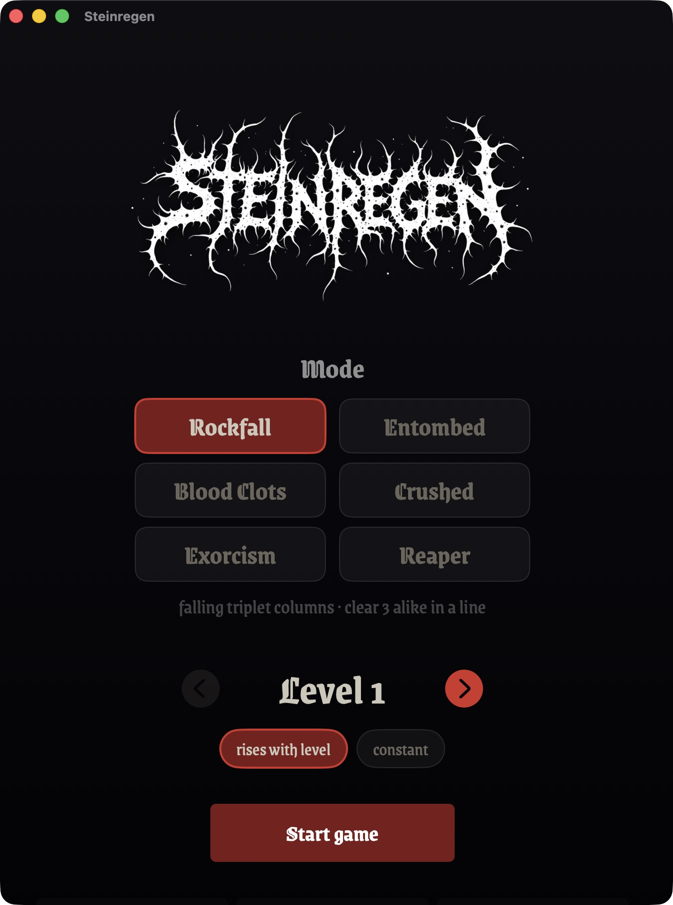
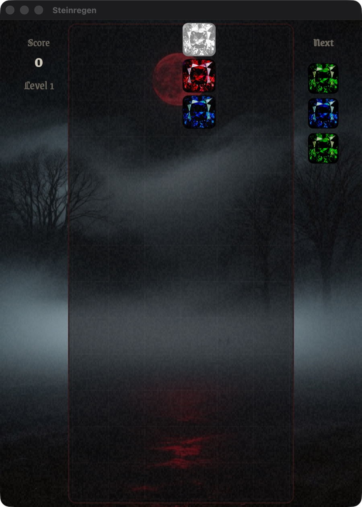
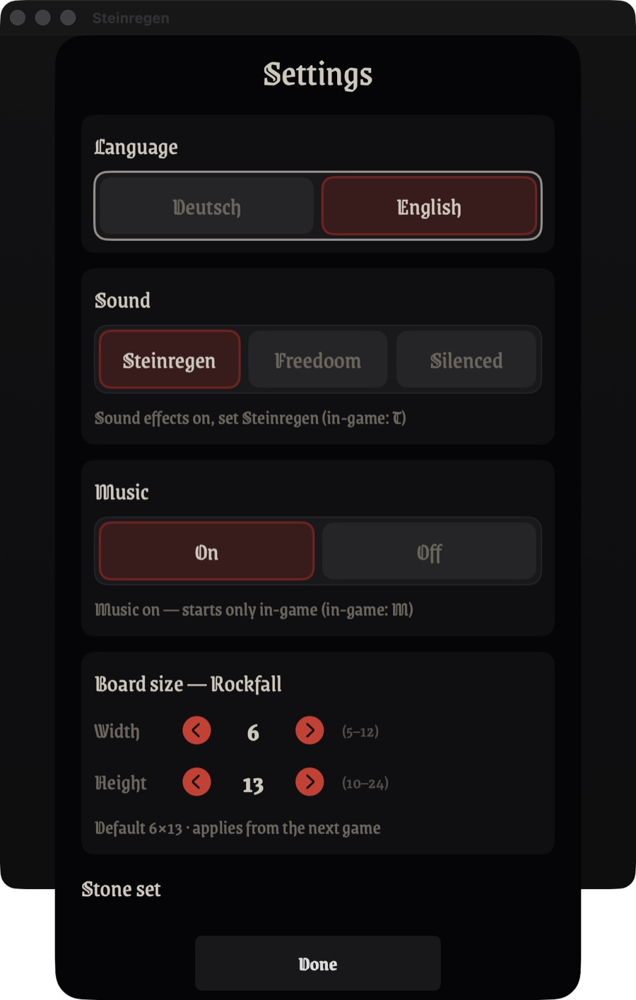

# Steinregen

A native macOS and iOS game in a raw black-metal style — six falling-block puzzle modes on one
shared, deterministic core. Written in Swift with SwiftUI and SpriteKit.

**🌐 Sprache / Language:** [English](README.md) · [Deutsch](README.de.md)

<p align="center">
  
  
  
</p>

## Release status

No public GitHub release has been published yet. To build the macOS or iOS app from source, see
[Build & Run](#build--run) below.

## Modes

- **Rockfall** (Columns-style) — falling columns of three stones. Line up **three or more of
  the same kind** horizontally, vertically, or diagonally to clear them; cleared stones make the
  ones above fall, which can set off chain reactions for bonus points.
- **Entombed** (Tetris-style) — falling tetromino pieces (four-block shapes). Fill a whole row to
  clear it. Seven shapes, a 7-bag randomizer, simple wall kicks.
- **Blood Clots** (Puyo-style) — falling two-stone pairs in four colors. Four or more of the same
  kind connected side by side clear; the halves fall independently, and cascades chain.
- **Crushed** (pentomino variant) — Entombed's brutal sibling: all 18 one-sided pentominoes
  (five-block shapes) on a bigger board.
- **Exorcism** (Dr.-Mario-style) — the board starts littered with curses that stick in place.
  Three colors; four or more in a row or column clear. Purge every curse and you **win** — the
  only mode with a victory condition.
- **Reaper** (Lumines-style) — falling 2×2 blocks of two stone kinds. Same-colored 2×2 squares
  are marked and then harvested by a scythe line sweeping across the board.

All six modes run on the same deterministic core and share the look, sound, music, and high-score
list. Pick the mode (and per-mode board size) on the start screen.

## Look

Pitch black, bone white, a single oxblood accent, film grain, a jagged hand-inked logo, and
AI-generated foggy-night backgrounds. The six stones are told apart by a white **sigil** (shape),
backed by a muted, desaturated color tint.

## Features

- **6 stones, marked by sigils** — inverted pentagram, inverted cross, Tiwaz rune, triquetra,
  skull, crescent. Told apart by shape, with a muted color tint as a secondary cue.
- **Selectable stone sets** — switch in Settings (with live preview) between six sets: the
  engraved "Sigils" and grimy "Doom" black-metal sets, three friendlier gem sets from the sibling
  project *Zaubersteine* ("Zaubersteine", "G20", "Jewels"), and a "FreeDoom" pixel-art set built
  from original Freedoom sprites. Adding one is a single renderer plus one registry entry.
- **Configurable board size** per mode, set in Settings.
- **Selectable starting speed** (levels 1–10), rising as you clear stones — or a constant
  "endless" tempo that keeps the starting speed.
- **Graveyard (high-score list)** — on death, enter a name (up to 16 chars); each grave
  shows the score and the level you died in. Persistent top 16, viewable from the menu.
- **Sound effects** (locally generated) — landing, clearing, rotating, level-up and game-over
  cues, with several random variants per event. In Settings you can pick a sound set —
  Steinregen (the project's own cues), Freedoom, or Silenced; **T** toggles in-game.
- **Music** (AI-generated) — 13 atmospheric instrumental metal tracks in a random,
  non-repeating order: every track plays once before a new shuffle begins. Three were generated
  locally with ACE-Step XL Turbo and ten with MiniMax Music 2.6; all are 128 kbit/s stereo MP3.
  Music is on by default but only starts with a level, not in the menu; toggle it independently in
  Settings or with **M** in-game.
- **Backgrounds** — AI-generated foggy-night motifs (graveyard, dead winter forest, ruined
  cathedral, foggy moor, blood-red moon); a different one each game, never the same twice in a row.
- **Magic Jewel** (Rockfall) — a rare, bright column pulsing through all six sigils. Where it
  lands it wipes every stone of the kind directly beneath it from the board.
- **Reproducible, seed-driven** — the same seed replays the exact same game, move for move.
- **Runs on macOS** (keyboard) **and iOS / iPad** (touch), sharing the same core and renderer.
- **English and German** — the interface follows your system language and can be switched in Settings.

## Controls

On iOS the game is played by touch (tap to rotate, swipe to move/drop, plus on-screen buttons).
On macOS, by keyboard:

| Key | Action |
|-----|--------|
| ← → · A D | move the piece |
| ↑ · W | rotate |
| ↓ · S | soft drop (faster fall) |
| Space | hard drop |
| T | toggle sound effects (off = "Silenced") |
| M | toggle music |
| Esc | back to main menu |

## Build & Run

Requires macOS 15+ and the Xcode toolchain.

```bash
swift build
swift run Steinregen
```

### Double-clickable app (with Dock icon)

```bash
bash tools/make-app.sh
```

Builds `dist/Steinregen.app` (ad-hoc signed, with a procedurally drawn Dock icon — an
inverted-pentagram sigil) plus a distributable `dist/Steinregen-<version>.zip`. Double-click the
`.app` in Finder, or drag it into `/Applications`. For a notarized, Gatekeeper-friendly build use
`bash tools/make-notarized.sh` (needs a Developer ID certificate and a notarytool keychain profile).

### Notarized DMG (for distribution)

```bash
bash tools/make-dmg.sh                 # signs + notarizes (needs a Developer ID cert + notary profile)
bash tools/make-dmg.sh --no-notarize   # unsigned — quick local layout test
```

Builds `dist/Steinregen-<version>.dmg`: the signed app inside a DMG with an install background and
an `Applications` shortcut, notarized and stapled so it opens without a Gatekeeper warning. The
background comes from `tools/generate-dmg-background.swift` (→ `assets/dmg-background.png`).

`GITHUB_REPO=owner/name bash tools/make-dmg.sh --publish` additionally tags `v<version>` and
creates the matching GitHub release with the DMG attached (notes from `CHANGELOG.md`). It requires
a configured `github` remote (or `GITHUB_REMOTE=<remote>`). A release is cut per version bump —
documentation-only or other changes that don't bump `VERSION` produce no new DMG.

### iOS app

```bash
bash tools/make-ios-app.sh run
```

Generates an Xcode project from `project.yml` via xcodegen and builds + launches the app in the
iOS Simulator (needs full Xcode and `xcodegen`).

### Tests

`swift test` alone fails on systems with only the Command Line Tools (no XCTest). Use the
Xcode toolchain:

```bash
DEVELOPER_DIR=/Applications/Xcode.app/Contents/Developer xcrun swift test
```

### Headless / automation

The app honors environment variables so it can be driven without the menu (useful for automated
screenshots and smoke tests):

```bash
STEINREGEN_AUTOSTART=1 STEINREGEN_LEVEL=8 STEINREGEN_SEED=4242 swift run Steinregen
```

- `STEINREGEN_AUTOSTART=1` — start a game immediately
- `STEINREGEN_LEVEL=<1..10>` — starting speed
- `STEINREGEN_SEED=<UInt64>` — fixed seed (otherwise random)
- `STEINREGEN_SET=<id>` — stone set (`sigil` / `doom` / `zaubersteine` / `g20` / `juwelen` / `freedoom`)
- `STEINREGEN_MODE=<id>` — mode: `saeulen` (Rockfall), `verschuettet` (Entombed),
  `klumpen` (Blood Clots), `fuenfling` (Crushed), `kapseln` (Exorcism), `schnitter` (Reaper)
- `STEINREGEN_ENDLESS=1` — constant tempo
- `STEINREGEN_MUSIC=<0|1>` — force music off / on
- `STEINREGEN_LANG=<de|en>` — force the language (otherwise system language / saved choice)
- `STEINREGEN_SETTINGS=1` — open the settings dialog on launch
- `STEINREGEN_FRIEDHOF=1` — open the Graveyard (high-score list) on launch
- `STEINREGEN_RULES=1` — open the game-rules dialog on launch

## Architecture

Three Swift Package Manager modules plus tests:

- **`SteinregenCore`** — pure game logic. Five engines (`Engine` for Rockfall, `TetrominoEngine`
  for Entombed and Crushed, `PairEngine` for Blood Clots, `CapsuleEngine` for Exorcism,
  `SquareEngine` for Reaper), board, match detection, cascades, magic jewel, scoring. No
  global randomness and no wall-clock; all randomness flows through an injected, seeded PRNG, so a
  given seed always replays identically.
- **`SteinregenRender`** — SpriteKit scene that drives all modes through one `PlayEngine`
  protocol: rendering, the gravity/animation loop, the procedurally drawn stone sets, the theme
  (palette/fonts/grain), sound effects, the music player, and the magic-jewel animation.
- **`SteinregenApp`** — SwiftUI shell for macOS and iOS: menus, settings, rules, the Graveyard, and
  game-over overlay. Keyboard input on macOS, touch on iOS.

Several reusable building blocks (the seeded PRNG, the robust resource loader, the
three-module layout) and the three "pleasant" gem sets (Zaubersteine / G20 / Jewels) come from
the sibling project *Zaubersteine*.

## Trademarks

Steinregen is an independent project and is not affiliated with, endorsed by, or sponsored by
anyone. Its six modes are inspired by classic falling-block puzzle games and are referred to only
by descriptive comparison: *Columns* and *Puyo Puyo* are trademarks of Sega, *Tetris* is a
registered trademark of The Tetris Company, LLC, *Dr. Mario* is a trademark of Nintendo, and
*Lumines* is a trademark of its respective owner. Steinregen's own modes are named *Rockfall*,
*Entombed*, *Blood Clots*, *Crushed*, *Exorcism*, and *Reaper*; it uses none of those third-party
names as its own and ships none of those games' graphics, sounds, or trade dress. Game mechanics are not copyrightable; the names are, and appear here
purely as nominative (descriptive) references.

## License

The source code is MIT-licensed — see [LICENSE](LICENSE). The bundled app is currently intended
for non-commercial distribution because its FLUX.1 [dev]-generated logo has a non-commercial model
license. See [THIRD-PARTY-ASSETS.md](THIRD-PARTY-ASSETS.md) for the complete asset terms.

Title/HUD typeface: **Grenze Gotisch** by Omnibus-Type, licensed under the
[SIL Open Font License](Sources/SteinregenRender/Resources/GrenzeGotisch-OFL.txt).

The "FreeDoom" stone-set sprites come from the
[Freedoom](https://github.com/freedoom/freedoom) project (its own free assets, not the original
commercial Doom material), licensed under
[BSD-3-Clause](Sources/SteinregenRender/Resources/FREEDOOM-LICENSE.txt).

The sound effects were generated locally with an open audio model (Stable Audio 3); three music
tracks with **ACE-Step XL Turbo** and ten with MiniMax Music 2.6; the foggy-night background
images with the open **Qwen-Image** model. All ship as part of this project. See
[THIRD-PARTY-ASSETS.md](THIRD-PARTY-ASSETS.md) for the full attribution and license overview.

🤖 Built with [Claude Code](https://claude.com/claude-code).
